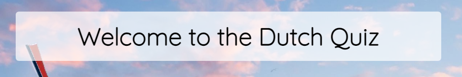
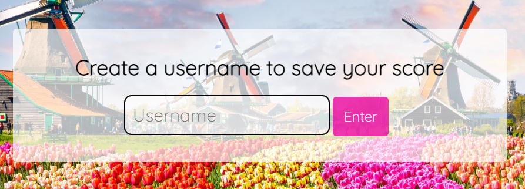
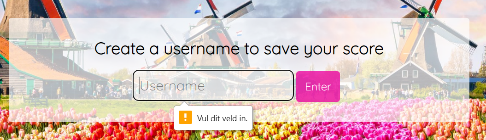
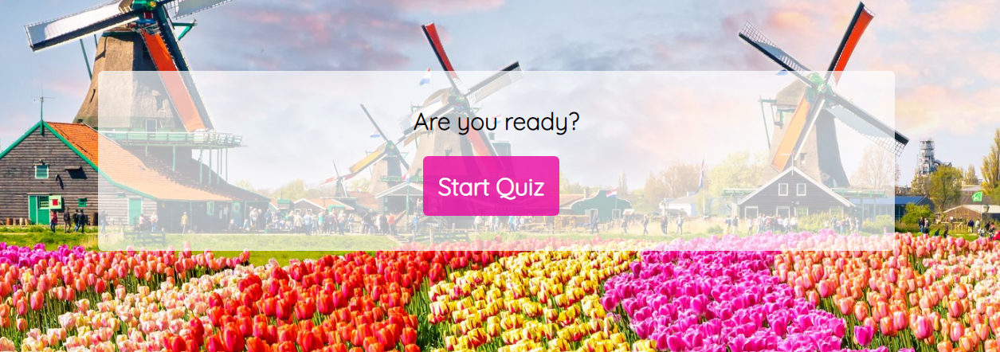
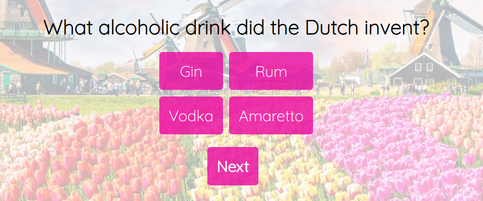
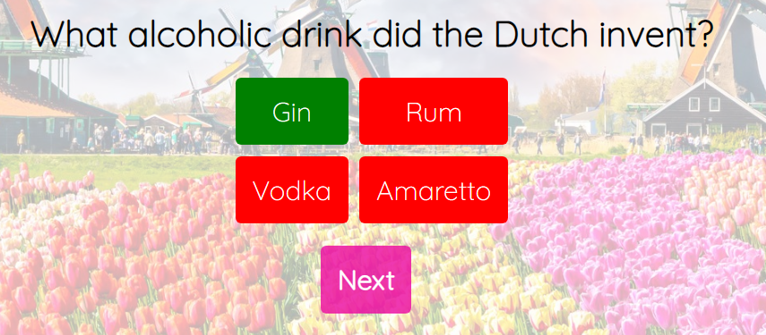
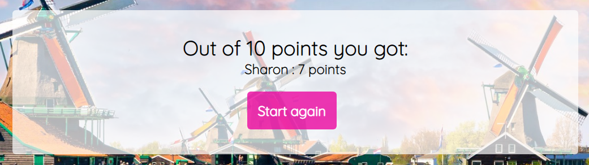
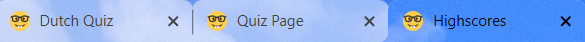
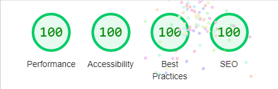

# The Dutch quiz
This quiz game will help you learn some facts about the Netherlands in a fun way. The facts are very random and are shuffled each time you play this game. I designed this quiz specificly for people who recently moved to the Netherlands and help them gain some knowlegde and conversation material. The user can actually learn something from simply playing this game. But actually this quiz is fun to play for everyone! <br> Are you ready to play and earn all the 10 points?


## Features
---
### Existing features
* Header
    * Featured at the first page of the game. The header welcomes the user to the quiz and shows the game name "The Dutch Quiz".
    

* Username
    * It asks the user to create a username so he can save his score.
    * If the user does not enter a username, the quiz will not start, but will say: 'This field is required'. On the printscreen this will state 'Vul dit veld in' because the computer language is in Dutch.
    * All text clearly contrasts with the background as there is a white padding behind it which makes it easy to read for the user.
    
    

* The game
    * Starting with asking the user if he/she is ready to take on this quiz, followed by a button that needs to be clicked in order to start the quiz. 
    * Then 10 questions follow which need to be answered by chosing one of the 4 answer buttons.
    * When clicked on an answer, the answers will turn red and green to show you which answer is correct and which are incorrect. This way the user will learn the correct answer right away.
    * There is time to reread the questions and answers and learn from the feedback given until the 'next' button is clicked.
    * There is also a possibility given to restart the quiz or to go back to the home page if the user does not want to finish the game. For this the user has to click on the 'Home' or 'Restart' button.
    
    
    
    

* The game result
    * For every correct answer the user gets one point. All correct answers are being saved and the points earned are showed after the last question. 
    

* Footer
    * The footer mentions the copyright and by who this project is created so the user knows not to copy the game without acknowledging the creator.
    

* Favicon
    * The game has a favicon so the user can find this game back easliy when a lot of browser tabs are open.
    


### Features left to implement
---
* I would like to expand this quiz to several quizzes. Each one with facts about another country. One homepage where the user can create a username which can be used to save scores for all quizzes available. Continuing with a dropdown menu where the user can choose the different country quizzes.
*  I would like to add a database so highscores can be saved from people all over the world. This way the users might be challenged more and willing to keep playing.
* I would like to add an extra JS file where the questions will be located, instead of in the main quiz file like right now. And then add more questions with different kinds of content like images. Unfortunately I ran out of time before the submission date so I will leave this for after completing my study at Code Institute.
* I might make answering the questions a requirement. Right now it is not required to give an answer and the user can continue to the next question without giving an answer.


## Testing
---
* I tested playing this game in the browsers: Chrome, Microsoft Edge.
* I confirmed that the quiz won't start without filling in a username. I tested this by pressing 'Enter' without a username filled in. The game mentioned 'This field is required' and won't continue.
* I confirmed that pressing the 'Enter' button works and directs to the game after filling in a username.
* I conformed that the hover works on all buttons. I tested this by hovering over every single button several times.
* I confirmed that the links are all directing to the correct page. I tested this by clicking on them by running the game several times. Each time the links direct to the correct page.
* I confirmed that the correct answer turns to green and the wrong answer to red after clicking on an answer. I tested this by clicking every answer.
* I confirmed that the game results are always correct and the points are counted perfectly. I tested this by keeping track of the correct scores (on paper) and checked if the points are counted correctly. I tried this a minimum of 10 times.
* I confirmed that the header, footer, questions and anwers, scores and buttons text is readable and easy to understand.
* I confirmed that the quiz is fully accesible by running it through Lighthouse in devtools.


* I confirm that this design is responsive, looks good and functions on all standard screensizes using the devtools device toolbar. I used two media queries for responsiveness at screen "max-width:850px" and at "max-width:440px". While testing responsiveness I used devtools in the chrome browser and changed the heigth and width to see how the screens would react. I confirm that this design is responsive for all screensizes to as small as 243 px wide.

* I confirm that there are no errors or bugs in the console while using devtools in the browswer. I tested this by running the game several times while keeping devtools open.


### Validator Testing
---
* HTML
    * No errors were returned when passing through the  W3C HTML validator
* CSS
    * No errors were returned when passing through the CSS Jigsaw validator
* JavaScript
    * No errors were returned when passing through the JavaScript JSHint validator.


### Bugs
---
#### Unsolved Bugs
* To my knowledge, there are no unfixed bugs at this moment.
#### Solved bugs
* When passing through the validators, I discovered that there were a few pages not correctly linked to the right JavasScript file. On the index.html file I linked two different JavaScript files instead of one.
* I accidentely used the absolute file path to locate files and images etc. I changed this to the relative file path.
* When deploying my quiz, I realised that the user could play the game without entering a username. 
I added an extra "addEventListener" when clicking on the "Enter" button. See the code below: 
```
form.addEventListener('submit', event => {
    event.preventDefault();
    window.location.href = '/quiz.html'
});
```
* While testing the quiz, I realised the user was not able to stop or start over while playing. So I added a 'Restart' and 'Home' button. 
```
<section id="console" class="hide">
    <a href="index.html" class="btn-link btn">Home</a>
    <a href="quiz.html" class="btn-link btn">Restart</a>
</section>
```
* The last thing I discovered was that the user could keep clicking on an answer of the same question which increased the score each time. I want the user to earn a maximum of one point per correct answer and not 15 for example.
I disabled the buttons to be clicked again and used the following code for this:
```
 if (e.target.dataset.correct) {
        score++;
        e.target.style.pointerEvents = 'none';
    }
```


## Deployment
The site was deployed to GitHub pages. The steps to deploy are as follows:
- Log in to Github.
- In the GitHub repository, navigate to 'Settings'
- On your left you can find the menu. Scroll down and navigate to 'Pages'.
- From the source section drop-down menu, select 'Main' and click on 'Save'.
- Now wait a few minutes.
- On top of the page a link will show saying that the website is publiced.

The link can be found here: https://sharondrinkwaard.github.io/portfolio-project-2/


## Credits
---
### Content
* The lettertype was taken from [Google Fonts](https://fonts.google.com/).
* Instructions on how to use JSON were taken from [W3schools](https://www.w3schools.com/js/js_json_intro.asp) and [Brian Design](https://www.youtube.com/watch?v=f4fB9Xg2JEY&t=2567s) on Youtube.
* The basic quiz code I used is from [Web Dev Simplified](https://www.youtube.com/watch?v=riDzcEQbX6k). This teacher helped me the most with understanding JavaScript.
### Media
* The background image is taken from [iStock](https://www.istockphoto.com/nl/foto/traditionele-nederlandse-windmolens-en-huizen-in-de-buurt-van-het-kanaal-in-zaanstad-gm937057490-256331390).
### Other
* The Favicon is taken from [Favicon](https://favicon.io/).
* For translating from Dutch to English I used [Google Translate](https://translate.google.com/).
* Tutor Support and my mentor Daisy.