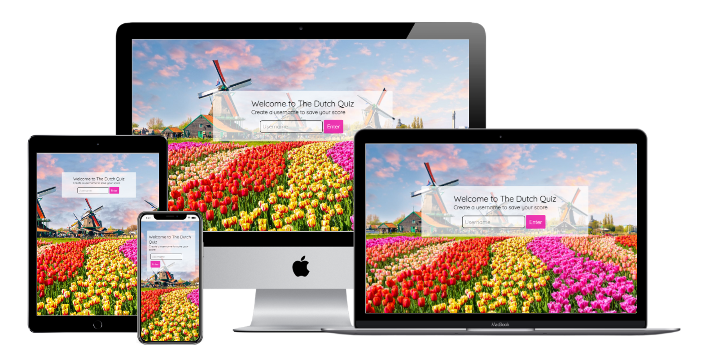

# The Dutch quiz
This quiz game will help you learn some facts about the Netherlands in a fun way. The facts are very random and are shuffled each time you play this game. I designed this quiz mainly for people who recently moved to the Netherlands and help them gain some knowlegde and conversation material. But actually this quiz is fun to play for everyone! <br> Are you ready to play and earn all the 10 points?



## Features
---
### Existing features
* Header
    * Featured at the first page of the game. The header welcomes you to the quiz and shows the game name "The Dutch Quiz".
    * It directs you to create a username.
    * If the user does not enter a username, the quiz will not start.
    * All text clearly contrasts with the background as there is a white padding behind it.


* The game
    * Starting with asking the user if he/she is ready to take on this quiz, followed by a button that needs to be clicked in order to start the quiz. 
    * Then 10 questions follow which need to be answered by chosing one of the 4 answer buttons.
    * When clicked on an answer, the answers will turn red and green to show you which answer is correct and which are incorrect.
    * There is time to reread the question and answer and learn from the feedback given until the 'next' button is clicked.


* The game result
    * For every correct answer the user gets one point. All correct answers are being saved and the points earned are showed after clicking the 'Show Me' button.
    


### Features left to implement
* I would like to expand this quiz to several quizzes.  Each one with facts about another country. One homepage where the user can create a username which can be used to save scores for all quizzes available. Continuing with a dropdown menu where the user can choose the different country quizzes.
*  I would like to add a database so highscores can be saved from people all over the world.
* I would like to add more questions with more different kinds of content like images. Unfortunately I ran out of time before the submission date so I will leave this for later.
---
## Testing
* I tested playing this game in the browsers: Chrome, Microsoft Edge.
* I confirmed that the game results are always correct and the points are counted perfectly.
* I confirmed that the header, questions and anwers, scores and buttons text is readable and easy to understand.
* I confirmed that the quiz is fully accesible by running it through lighthouse in devtools.
* I confirm that this design is responsive, looks good and functions on all standard screensizes using the devtools device toolbar.


### Bugs
#### Solved bugs
* When passing through the validators, I discovered that there were a few pages not correctly linked to the right JavasScript file. On the index.html file I linked two different JavaScript files instead of one.
* I accidentely used the absolute file path to locate files and images etc. I changed this to the relative file path.
* When deploying my quiz, I realised that the user could play the game without entering a username. 
I added an extra "addEventListener" when clicking on the "Enter" button. See the code below: 
```
form.addEventListener('submit', event => {
    event.preventDefault();
    window.location.href = '/quiz.html'
});
``` 
### Validator Testing
* HTML
    * No errors were returned when passing through the  W3C HTML validator
* CSS
    * No errors were returned when passing through the CSS Jigsaw validator
* JavaScript
    * No errors were returned when passing through the JavaScript JSHint validator. 
### Unfixed Bugs
* To my knowledge, there are no unfixed bugs at this moment.
---

## Deployment
The site was deployed to GitHub pages. The steps to deploy are as follows:
- In the GitHub repository, navigate to Settings
- On your left you can find the menu. Scroll down and navigate to Pages
- From the source section drop-down menu, select Main and click on Save
- On top of the page a link will show saying that the website is publiced

The link can be found here: https://sharondrinkwaard.github.io/portfolio-project-2/

---
## Credits

### Content
* The lettertype was taken from [Google Fonts](https://fonts.google.com/)
* Instructions on how to use JSON were taken from [W3schools](https://www.w3schools.com/js/js_json_intro.asp) and [Brian Design](https://www.youtube.com/watch?v=f4fB9Xg2JEY&t=2567s) on Youtube
### Media
* The background image is taken from [iStock](https://www.istockphoto.com/nl/foto/traditionele-nederlandse-windmolens-en-huizen-in-de-buurt-van-het-kanaal-in-zaanstad-gm937057490-256331390)